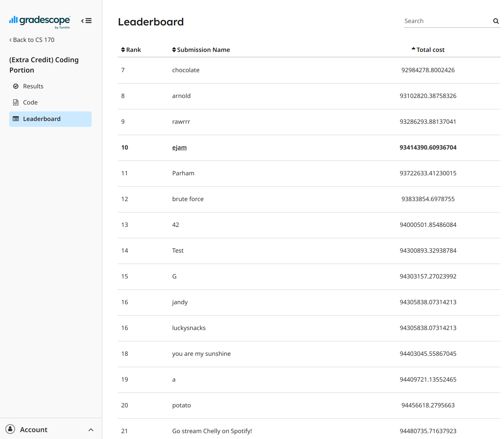

# What is this?
[Metric tsp](https://en.wikipedia.org/wiki/Travelling_salesman_problem#Metric) approximation for cs170 that I should've documented, but I did not, so I'm writing this up 4 months later. See [hw12-coding-instructions.pdf](hw12-coding-instructions.pdf)

# Very messy explaination of how it works
Main function is `improved_tsp_approximation`, which runs the main algorithm `metric_tsp_approximation` and `improve` several times.

## `metric_tsp_approximation`
This is modified from the 2-approximation described in section 9.2.3 of DPV [here](https://people.eecs.berkeley.edu/~vazirani/algorithms/chap9.pdf). In short, the algorithm computes the MST, then traverse the node in the order of in-order traversal.

This algorithm builds on this idea and add some randomization. First, we shuffle parts of the sorted array and run Kruskal's algorithm on this imperfectly sorted array. This doesn't give us the MST, but adds some randomization in hopes of better results when running the tsp approximation multiple times.

Then, for dfs, we return multiple candidate path in the form of map[last node, (path, cost)]. On each node during dfs, we find the best ordering to visit child nodes by looking at the first 120 permutation and computing their costs using `join_leaf_cost`, which will look at the result from dfs and find the best way to connect nodes.

## `improve`
Attemps to improve by swapping.

## Putting it all together
We run the algorithm multiple times and pick the best run, with a time limit on each test case. Some commented out code runs the algorithm in parallel for faster local testing.

# Result
Got 10th place on the leaderboard.

