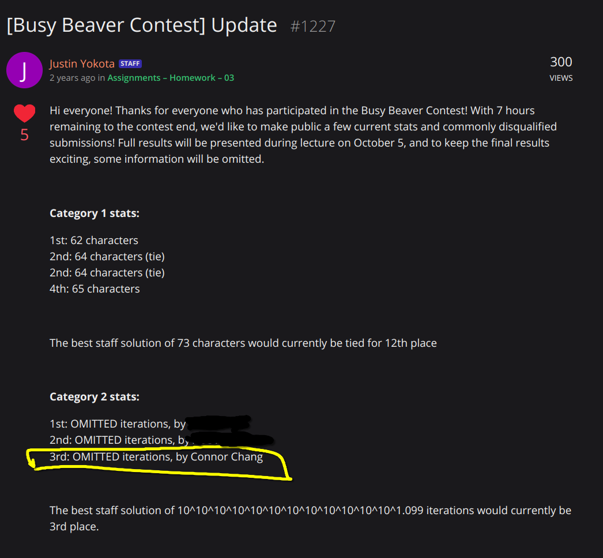

# 61A Busy Beaver Contests
Call f as many times as possible in 100 characters. See https://inst.eecs.berkeley.edu/~cs61a/fa22/hw/hw03/#q4-busy-beaver-contest

Won this dope stuffed beaver in a can!


3rd place 7 hours before the contest ends:


# Code
Arrows are Knuth's up-arrow notation. I'm not sure which one is larger and I'm not sure which one won.
```py
def beaver(f):
    (b:=lambda x:lambda h:x(x(x(h))))(b)(b)(b)(b)(b)(b)(b)(b)(b)(b)(b)(lambda h:lambda:h()or h())(f)()
```
Calls f() 2↑(3↑↑12) times (if I did my calculations correctly)

```py
def beaver(f):
    (b:=lambda x:lambda h:x(x(x(x(h)))))(b)(b)(b)(b)(b)(b)(b)(b)(b)(b)(lambda h:lambda:h()or h())(f)()
```
Calls f() 2↑(3↑↑12) times (if I did my calculations correctly)
